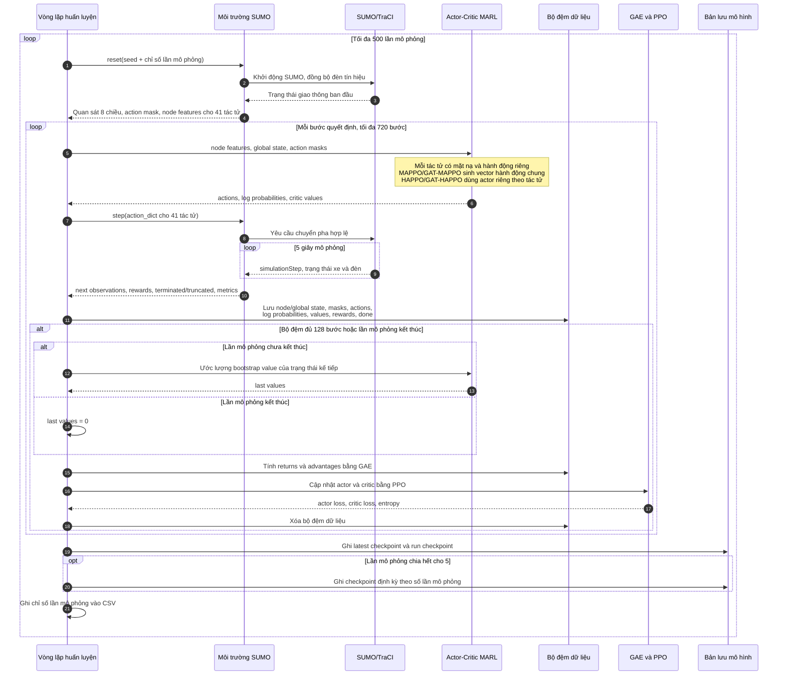
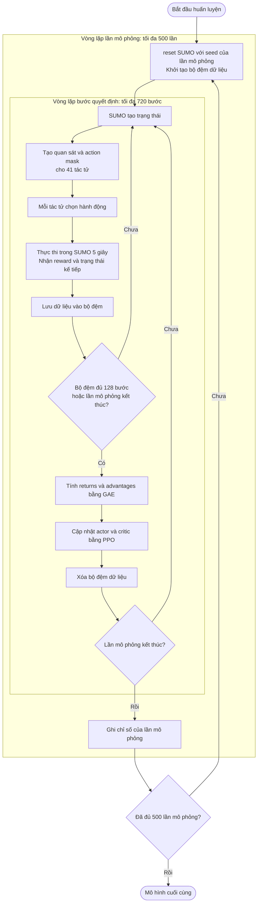

# Sơ đồ tuần tự huấn luyện

Sơ đồ dưới đây đối chiếu với mã nguồn thí nghiệm tại `src/train.py`, `src/env.py` và `src/mappo.py` của kịch bản Thanh Xuân UTM.

Các điểm cần nhớ khi trình bày:

- Một lần mô phỏng (episode) có giới hạn thời gian 3.600 giây, tương đương tối đa 720 bước quyết định 5 giây. Lần mô phỏng cũng có thể kết thúc sớm khi SUMO không còn phương tiện dự kiến.
- Mỗi bước tạo dữ liệu cho toàn bộ 41 tác tử điều khiển. Mỗi tác tử nhận quan sát và mặt nạ hành động riêng, sau đó có một hành động trong vector hành động chung.
- Bộ đệm dữ liệu tương tác (`RolloutBuffer`) có sức chứa mặc định 128 bước. GAE và PPO được thực hiện khi bộ đệm đầy hoặc lần mô phỏng kết thúc, do đó một lần mô phỏng có thể có nhiều lần cập nhật.
- Bản lưu mới nhất được ghi sau mỗi lần mô phỏng; bản lưu định kỳ theo số lần mô phỏng được ghi mỗi 5 lần theo cấu hình mặc định.

## Sơ đồ vòng lặp lồng nhau

